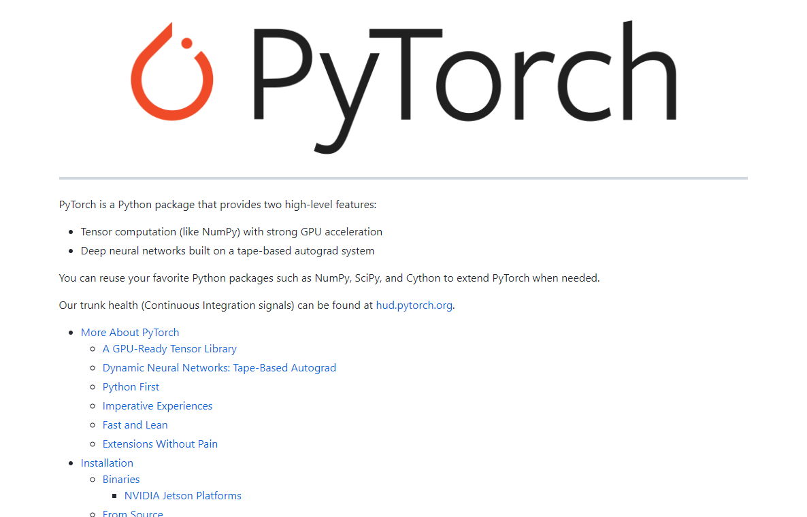
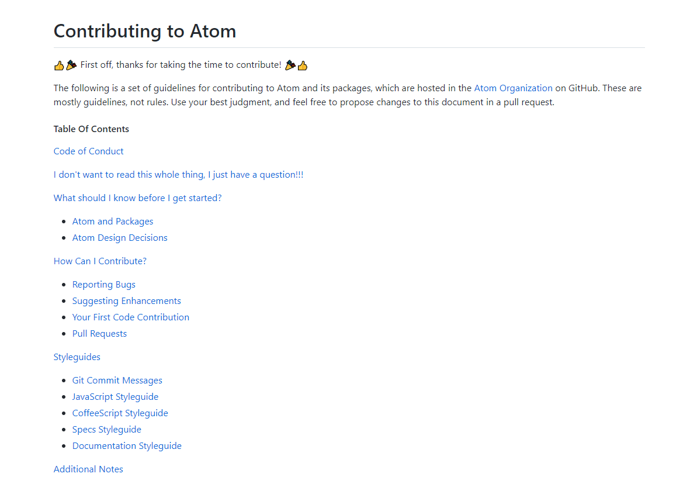

# A Guide to Open Source

An open source manual for contributing to or maintaining an open source project.

## Finding an Open Source Project

## Contributing to an Open Source Project

Once you find an issue or project that you'd like to contribute to, it's time to learn how exactly you can go about contributing. The first step to contributing is exploring the source code. Source code is the original code for the project made and maintained by the creator. This is the official version of the project’s code.
### Licensing
Depending on the licensing of the code it will tell you what you can do with the source code. This could determine whether you can sell your version or publish it. 

Many open-source projects are what is called copyleft. This means that you must maintain the same licensing on your project as the main project. Once you understand what you're allowed to do, it's time to explore.

### Getting Source Code
You're going to want to create a local copy of the project you'd like to contribute to on your machine. This is the best way to explore the code and test the project for yourself. 

### Git
First, you’re going to want to install git. To do this, follow these links depending on your OS

- Windows: https://git-for-windows.github.io/
- macOS: https://code.google.com/archive/p/git-osx-installer/downloads
- Linux: https://git-scm.com/book/en/v2/Getting-Started-Installing-Git

### Cloning a Repository
Go to the repository page of the project you are interested in. There will be a button labeled code or clone. This depends on the repository site you are using. [GitHub](https://github.com) for example will have a green ‘CODE’ button. For example, click the green octo-cat in the upper right-hand corner of this page to check out the repository for this project. 

Click the ‘CODE’ button and find the link to the repository. Copy this link onto your clipboard. Then you're going to want to open your command line or terminal. This depends on your Operating System. macOS and Linux use the Unix shell and Windows use the Command Prompt. The process is the same for both. 

__Example__


Open your OS’s shell. You’re going to want to change directories (folders) to where you want to put the project folder. To do this type ‘cd’ then the subsequent folders. For example, if you want to put it on your desktop, you can input ‘cd Desktop’. If you have a folder on your desktop you’d like to put it in you can do ‘cd Desktop/project’. Once you’ve reached your preferred folder you can press enter. 

The next command is 
```shell
git clone <link> 
``` 
instead of the brackets <> place your link instead. This will copy the repository files into the folder you had selected with the 'cd' command. 

Now you’re going to want to open the folder with your preferred IDE. [VScode](https://code.visualstudio.com) is a popular option that has a lot of good features and has many extensions to make coding better. 
### What to Do With Source Code
You can now explore and run the code for yourself locally on your machine. Your edits will be personal to your local download, for now. 

Contributing doesn't have to be just code. 

You can:
- Add features
- Fix bugs
- Create documentation
- Curate examples of the project's uses
- Restructure layout for usability
- Fix typos
- Answer questions about the project
- Start a newsletter

Your contributions to an open-source project can start small but everything helps. Creating documentation can help new contributors better understand what they are looking at within the source code. You can document source code by creating full documentation sites or just add comments in the code to explain different methods and parts of it.

Before you push your changes to the main repository you’ll need to understand workflow and communication within an open-source project.
 
### Workflow

Workflow allows the contributors and owners to maintain a good idea of what is happening as the project evolves. This is very important for large projects; however, even for small projects, it can be good to establish good workflow habits. 

Git offers a few ways to organize your work. The most important are branches, pull requests, and push requests.

When you're ready to start contributing, it will help to create a fork of the main project's repository. This fork will be a copy of the repository. You can do this within the particular website hosting the repository. This is important because if you are new to a project you will not have permission to make branches and merges. 

Now, you're gonna want to clone that fork. 
``` shell
git clone <link to your fork>
```

#### Branches

Branches allow you to separate your edits from the master repository. Organizing the project with branches allows you to implement new features without conflicting with the master branch.

To branch in a repository you are a contributor to, you can do:
```shell
git branch <branch name>
```
Naming your branch well can help with organization. For example, you can name the branch the name of the feature you're implementing. You can make multiple branches for all your different features.

To check your branches and which branch you're in you can use:
```shell
git branch
```
The output will look like this:
```shell
*branch1
branch2
master
```
The asterisks will denote the branch you are currently editing in. To change the branch you're in you do:
```shell
git checkout <branch name>
```

To learn more about branching and version control with git commands [visit here](https://learngitbranching.js.org)

#### Pull/Merge requests

Once you've made a change, it's time to submit your changes to your fork. To do this you're going to push your changes to your fork. To do this you can do:
```shell
git add <file name>
git push <message>
```
Git in the shell/terminal can get confusing, VScode has extensions to make this easier. Now that your changes to your fork have been pushed to your fork, you can make a pull request to the main repository.

I will use Github as an example. On the repository page for the project, you will be able to open a pull request to the project page to ask them to merge your work into the main repository.

Then you'll see all of the differences between your fork and the main repository. The subject line of your pull request should be relevant to what your changes were. If the feature you're implementing is still a work in progress you can label it with '*WIP*' which stands for 'Work in Progress'.

Many projects will have a section in their README about how to contribute and if they have certain instructions but in general, you'll want to include before and after screenshots if you made changes to the front-end of a project and give detailed descriptions of the changes you have made. If you do coding on the project its good to leave lots of comments and use general syntax conventions for the language. Projects may outline this in their README or their source code. If not, always maintain the same conventions as the source code uses. For example, camelCase, PascalCase, or snake_case. 

Finally, to update your local fork you can type the command:
``` shell
git pull
```
while in your master branch. 

Forking, Branching, Pushing, and Pulling is all the things you and other contributors will use to maintain an organized workflow on a project. You can read through other people's forks, branches, and requests as well and make comments and find issues. The review process is the largest collaboration on a project.

### Communication

It is best to communicate with the project community about your work. You can do this by reading the README and joining/subscribing to any discord servers or newsletters. Some larger projects even have monthly Zoom meetings where you can learn more about the project direction and development. 

These projects will also have places to host conversations about the project. A Discord server, Subreddit, or posts on StackOverflow for example. Here is where you can engage with the community members.

Once you have contributed to a project, maybe you'd like to solve an issue yourself and start your project. To learn how; read on.

## Maintaining an Open Source Project

Maintaining an open source project requires engaging with users and building a strong developer community. This means building an attractive product, a welcoming community, and a strong leadership.

### Documenting your Project

Documentation is an integral part of building an open source project. It helps users understand and interact with your project, and it helps contributors make efficient and meaningful changes. As your project grows, documentation pulls information and ideas out of your head and into a reproducible, accessible format.

#### Product Documentation

The first type of documentation necessary for an open source project is **product documentation**. Product documentation intends to educate both users and contributors about the project and what is being built. This information should be placed into the project's **README**, which is a [markdown](https://en.wikipedia.org/wiki/Markdown) file entitled `README.md` that exists in the root directory of the project. The product documentation should cover the following:

1. What the product is and why it's important (what problems it solves, how it is better than existing solutions)
   * This is your chance to grab the attention of potential users and contributors. The gist of your project should only be a few sentences and should appear at the very beginning of your README.
2. What the future of the product is (planned maintenance, planned features)
   * For people to rely on your product, they must be confident that it will be maintained in the future. You should clearly communicate your plans for supporting different versions of your product.
   * Planned features should be listed in a simple roadmap. This not only demonstrates your future intent to users but could attract contributors.
3. How to use the product (installation, quick start, and common usages)
   * The installation guide should take the form of clear, concise, step-by-step instructions.
   * The quick-start guide should provide the simplest and most common way to get the product into a working state.
   * The common usages section should provide step-by-step instructions for the most common uses of the product.
4. What one is allowed to do with the product (licenses)
   * A summary regarding how the project can be altered and redistributed should be placed in the README and should link to the license file for more detailed information.

[PyTorch's README](https://github.com/pytorch/pytorch/blob/master/README.md) exemplifies effective product documentation:



#### Contributor Documentation

Contributors are the lifeblood of your project, so writing good documentation for contributors is paramount as your operation expands. **Contributor documentation** should be located in the project's `CONTRIBUTING.md` [markdown](https://en.wikipedia.org/wiki/Markdown) file located in the root directory of the project. It should include information related to:

1. What to know before contributing (pertinent technical information)
   * This section should come first and should include any overarching information that will help contributors make informed design decisions. For example, formally defining the scope of the project (the goals and non-goals).
2. What you're looking for in contributions
   * Unwanted contributions can happen, so this section should indicate directly what kinds of contributions your project is looking for. This helps avoid wasted effort and frustration.
3. How to contribute (finding an issue, making an effective pull request)
   * Should include a step-by-step guide to finding an issue and identifying issues that are beginner friendly.
   * How to write the PR description and what information to include
4. How to write an issue / report a bug
   * How to write the issue description and what information to include

[Atom's CONTRIBUTING.md](https://github.com/atom/atom/blob/master/CONTRIBUTING.md) exemplifies effective contributor documentation:



### Building a Strong Developer Community

Building an inviting, friendly, and engaging development environment will encourage more people to contribute to your project. A positive development community should be built around the following pillars:

1. Feedback in a friendly manner
   * Feedback should not be personal, and comments should be patient with the other contributors
   * Additionally, feedback should not be *taken* personally. Comments are made toward the contribution and not towards the individual.
   * For example:  `Your contribution doesn’t match this project’s criteria` versus `I don’t like your contribution` 
2. Mentorship
   * Mentorship is an effective way of disseminating the knowledge of senior contributors.
   * Mentorship also can help new contributors overcome the anxieties related to contributing.
3. Central communication
   * Central communication channels like mailing lists or weekly developer meetings will help contributors stay engaged with your project
